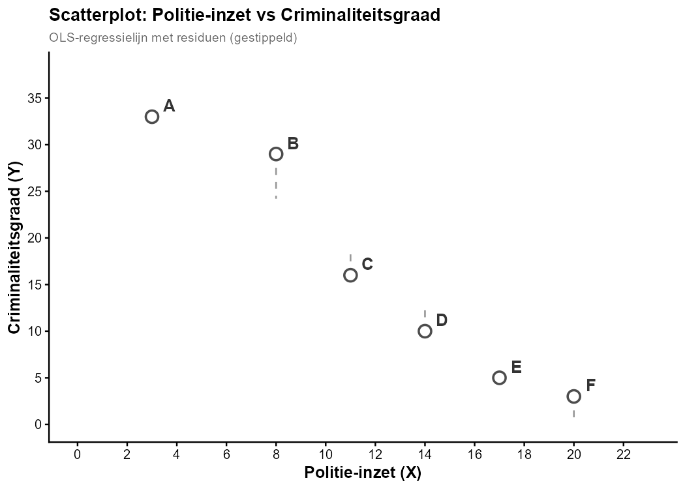

In een criminologische studie naar de relatie tussen **politie-inzet (X)** en **criminaliteitsgraad (Y)** werden gegevens verzameld voor 6 stedelijke wijken. De scatterplot toont de observaties samen met de OLS-regressielijn.

Welke observatie vertoont het **grootste absolute residu** ten opzichte van de regressielijn?