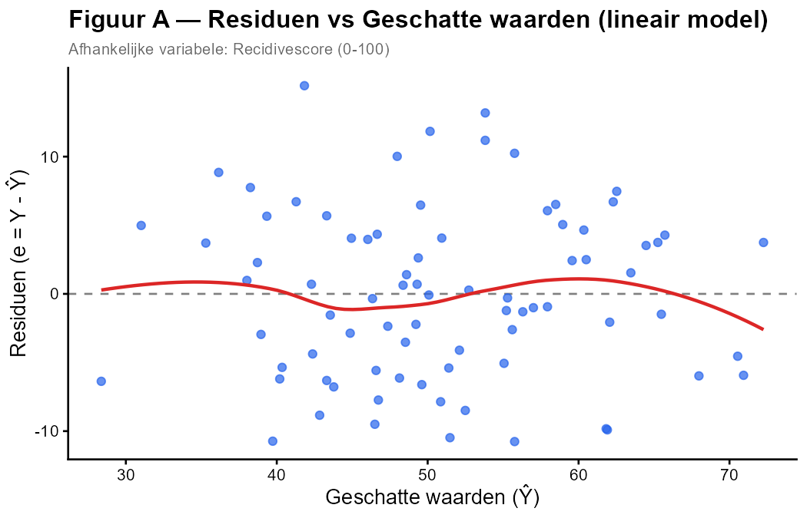
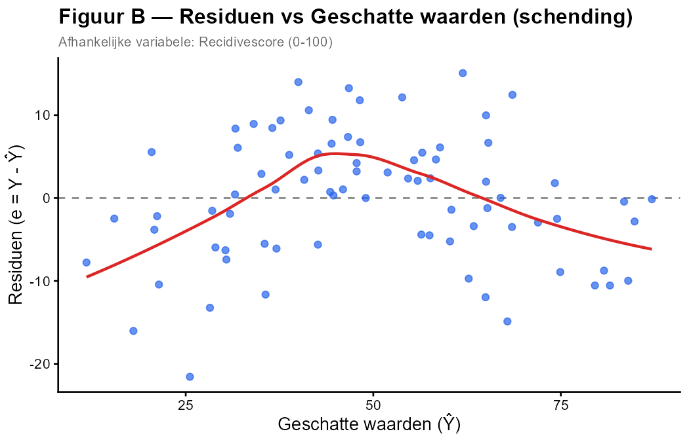

Een criminoloog onderzoekt welke factoren de **recidivescore** (0–100) van ex-gedetineerden beïnvloeden. Hij past een meervoudige regressie toe met als predictoren **ondersteuningsuren per maand** (X₁) en **risicoschaal** (X₂, hogere score = hoger risico).

Na het schatten van het model inspecteert hij de diagnostische plots om de assumptie van **lineariteit** te controleren.

---

Hieronder zie je twee versies van de **Residuen vs Geschatte waarden**-plot.

---

De **rode lijn** in de plot is een LOESS-smoother die de gemiddelde trend in de residuen weergeeft.

**Welke uitspraak is JUIST?**

1. Figuur A toont een schending van lineariteit — de rode lijn is systematisch gebogen.
2. Figuur B toont een schending van lineariteit — de rode lijn vertoont een duidelijke kromming.
3. Beide figuren tonen een schending van lineariteit.
4. Geen van beide figuren toont een schending van lineariteit.

**Hint:** *Bij een lineair verband liggen de residuen willekeurig rond de nullijn (horizontale stippellijn). Een gebogen patroon in de smoother wijst op niet-lineariteit.*

- Typ je antwoord als één enkel getal (1-4) om je keuze aan te geven
