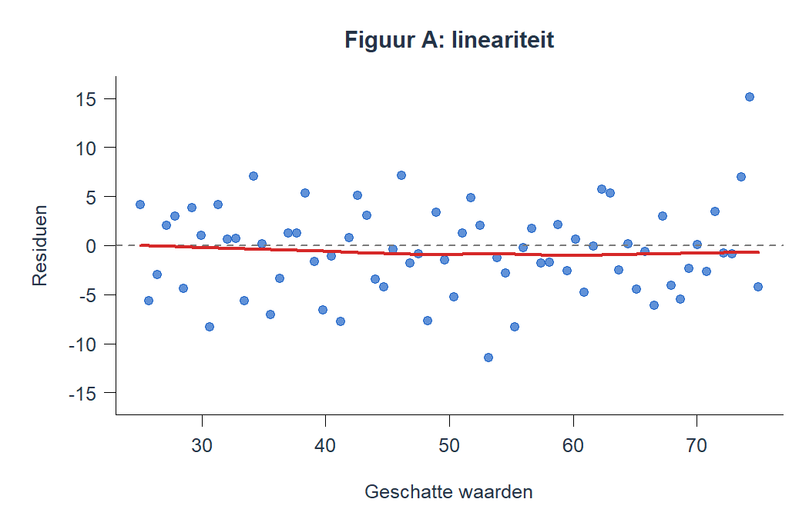
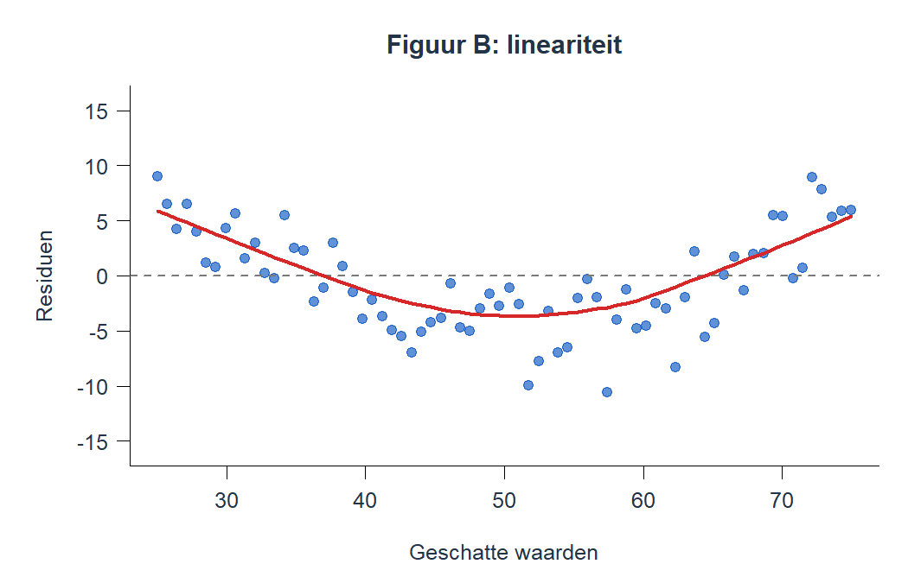
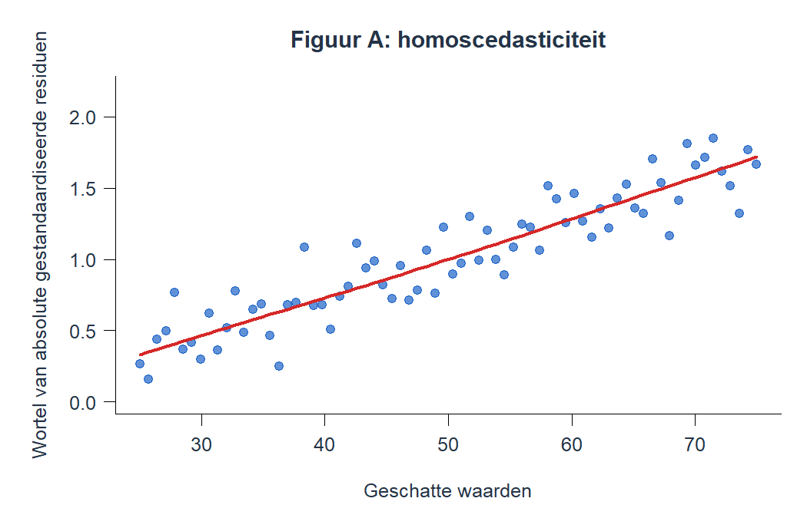
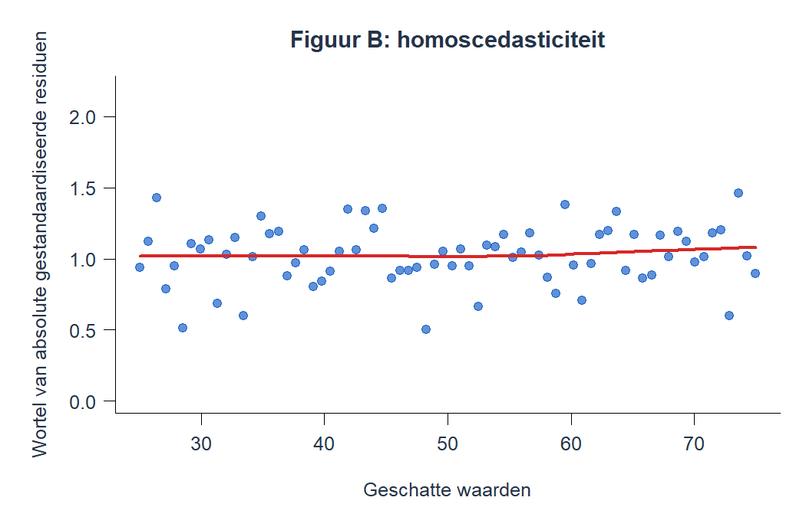
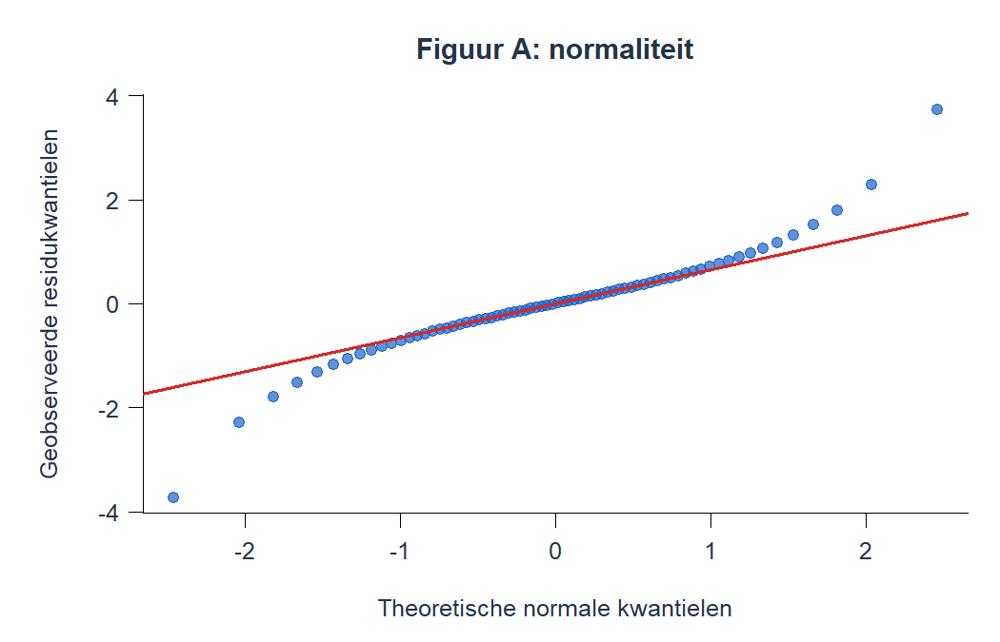
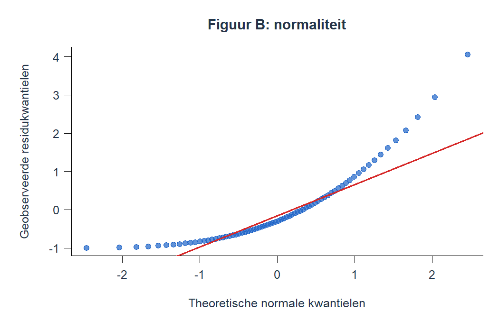
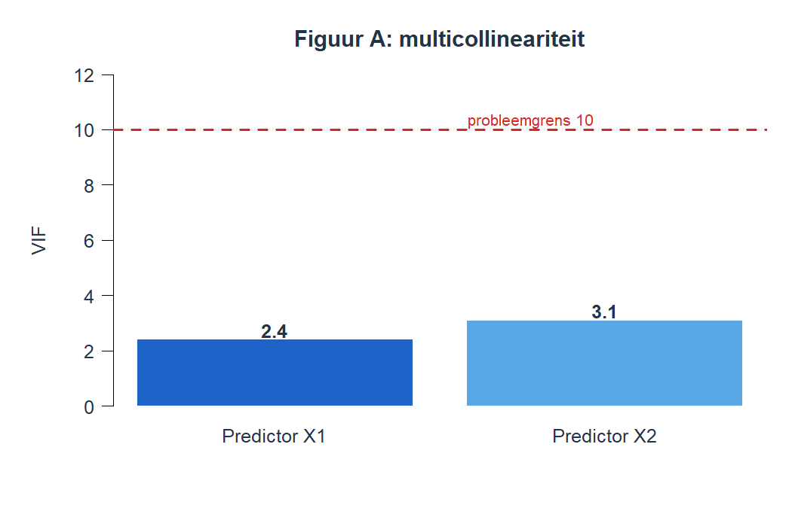
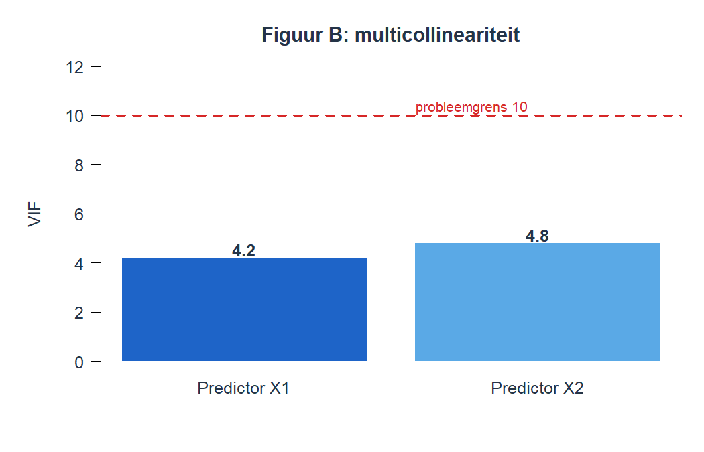

Diagnostische grafieken en kengetallen helpen bepalen of de assumpties van een regressiemodel aannemelijk zijn.

**Leerdoel:** vier regressieassumpties afzonderlijk beoordelen door in elke diagnose het relevante patroon te herkennen.

Gebruik bij **elke** vraag dezelfde antwoordcodes:

- 1 = alleen figuur of model A toont het probleem;
- 2 = alleen figuur of model B toont het probleem;
- 3 = beide tonen het probleem;
- 4 = geen van beide toont het probleem.

## 1. Lineariteit

Welke residuenplot toont een systematische niet-lineaire trend?

 

## 2. Homoscedasticiteit

Welke scale-locationplot toont heteroscedasticiteit?

 

## 3. Normaliteit van de residuen

Welke Q-Q-plot wijkt systematisch af van de rode referentielijn?

 

## 4. Multicollineariteit

Welke VIF-diagnose overschrijdt de aangegeven probleemgrens van 10?

 

Vul in het codebestand voor de vier diagnoses telkens de juiste antwoordcode in.
