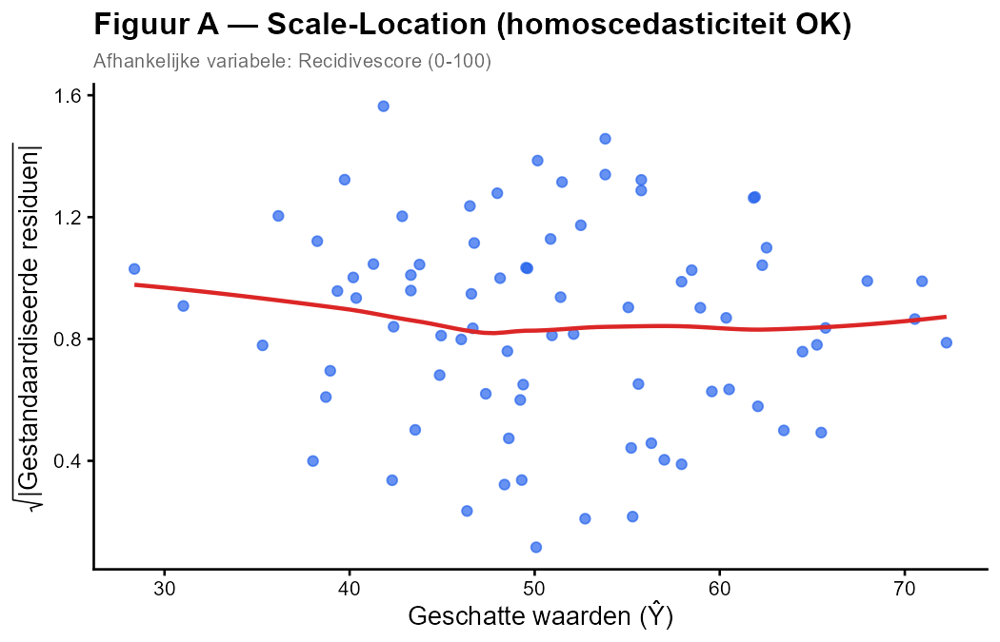
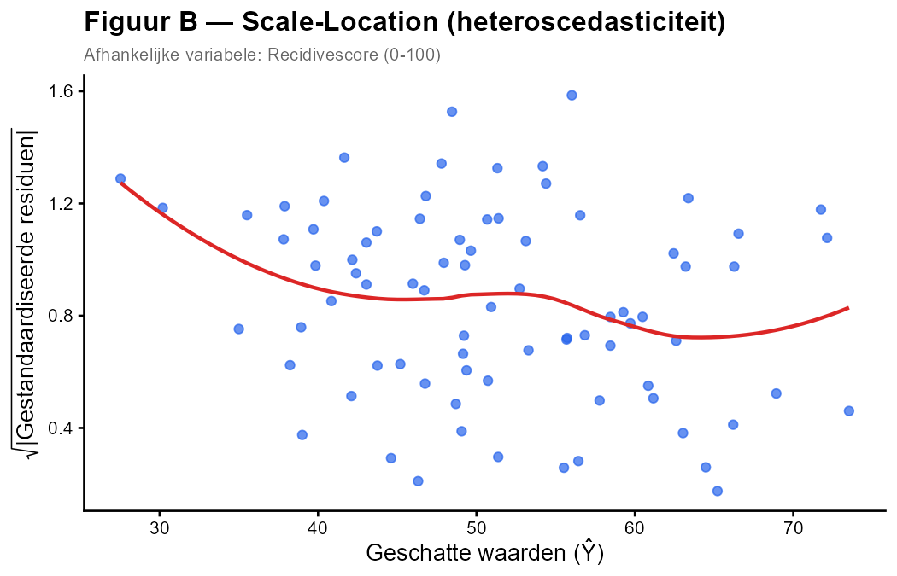

Een criminoloog onderzoekt de **recidivescore** (0–100) van ex-gedetineerden via meervoudige regressie met predictoren **ondersteuningsuren per maand** (X₁) en **risicoschaal** (X₂).

Om de assumptie van **homoscedasticiteit** (gelijke spreiding van de residuen) te controleren, bekijkt hij de **Scale-Location plot**. Op de y-as staat de vierkantswortel van de absolute waarde van de gestandaardiseerde residuen; de rode lijn is opnieuw een LOESS-smoother.

---

---

**Welke uitspraak is JUIST?**

1. Figuur A toont heteroscedasticiteit — de spreiding neemt toe bij hogere geschatte waarden.
2. Figuur B toont heteroscedasticiteit — de rode lijn stijgt naarmate de geschatte waarden toenemen.
3. Beide figuren tonen heteroscedasticiteit.
4. Geen van beide figuren toont een probleem met homoscedasticiteit.

**Hint:** *Bij homoscedasticiteit liggen de punten gelijkmatig verspreid en is de smoother nagenoeg vlak. Een stijgende smoother duidt erop dat de variantie van de residuen toeneemt met de geschatte waarden (= heteroscedasticiteit).*

- Typ je antwoord als één enkel getal (1-4) om je keuze aan te geven
