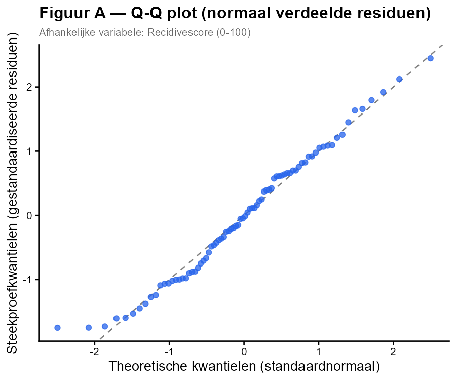
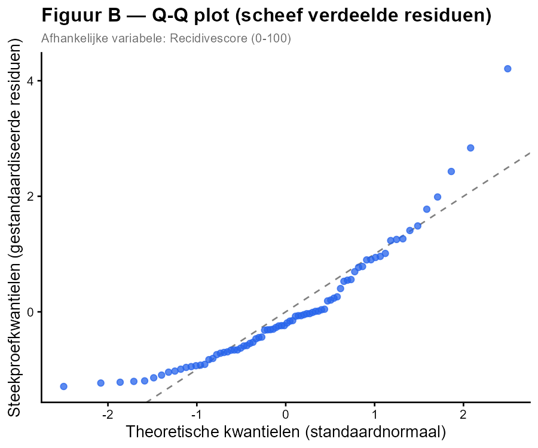

Een criminoloog schat een meervoudige regressie van **recidivescore** (0–100) op **ondersteuningsuren per maand** (X₁) en **risicoschaal** (X₂).

De assumptie van **normaliteit van de residuen** wordt gecontroleerd via een **Q-Q plot** (kwantiel-kwantielplot). Op de x-as staan de theoretische kwantielen van de standaardnormaalverdeling; op de y-as de kwantielen van de gestandaardiseerde residuen. Als de residuen normaal verdeeld zijn, vallen de punten op de diagonale stippellijn.

---

---

**Welke uitspraak is JUIST?**

1. Figuur A toont een schending van normaliteit — de punten wijken systematisch af van de diagonaal.
2. Figuur B toont een schending van normaliteit — de punten buigen rechts duidelijk naar boven af van de diagonaal.
3. Beide figuren tonen een schending van normaliteit.
4. Geen van beide figuren toont een schending van normaliteit.

**Hint:** *Punten die de diagonaal goed volgen wijzen op normaal verdeelde residuen. Een opwaartse of neerwaartse buiging aan de uiteinden duidt op een scheve verdeling (rechts respectievelijk links scheef).*

- Typ je antwoord als één enkel getal (1-4) om je keuze aan te geven
