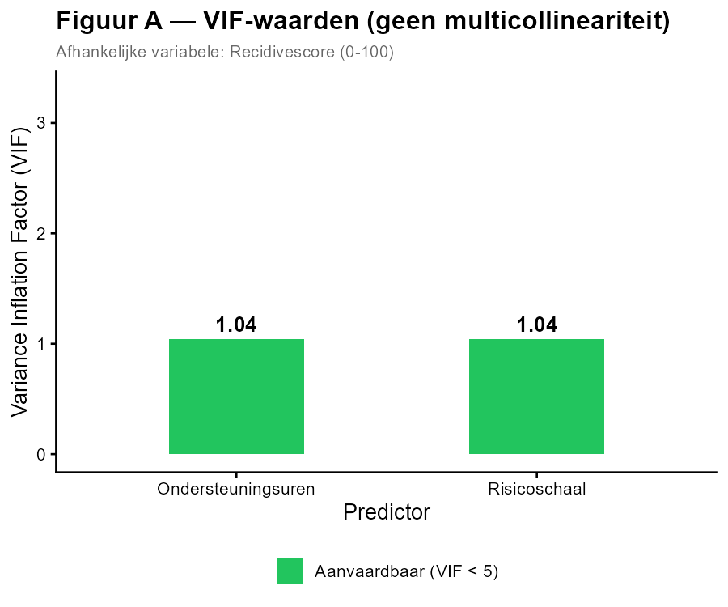
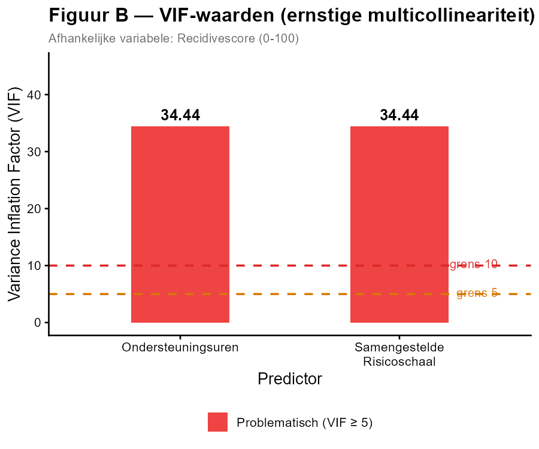

Een criminoloog wil de **recidivescore** (0–100) van ex-gedetineerden verklaren via meervoudige regressie.

In **Model A** gebruikt hij als predictoren:
- **Ondersteuningsuren per maand** (X₁)
- **Risicoschaal** (X₂, een samengestelde score van criminogene behoeften)

In **Model B** vervangt hij de risicoschaal door een **samengestelde risicoschaal** die bijna volledig lineair afhankelijk is van de ondersteuningsuren (r ≈ 0,99).

**Multicollineariteit** — te hoge correlatie tussen predictoren — kan de regressiecoëfficiënten onbetrouwbaar maken. De **VIF** (Variance Inflation Factor) meet dit: een VIF < 5 is aanvaardbaar, VIF ≥ 5 is problematisch, VIF ≥ 10 is ernstig.

---

---

**Welke uitspraak is JUIST?**

1. Model A heeft een multicollineariteitsprobleem — beide VIF-waarden overschrijden de grens van 5.
2. Model B heeft een multicollineariteitsprobleem — beide VIF-waarden zijn groter dan 10.
3. Beide modellen hebben een multicollineariteitsprobleem.
4. Geen van beide modellen heeft een multicollineariteitsprobleem.

**Hint:** *Vergelijk de VIF-waarden in beide figuren met de grenzen van 5 en 10. Een VIF ≥ 10 wijst op een ernstig probleem waarbij de schattingen van de regressiecoëfficiënten sterk beïnvloed worden door de hoge correlatie tussen de predictoren.*

- Typ je antwoord als één enkel getal (1-4) om je keuze aan te geven
