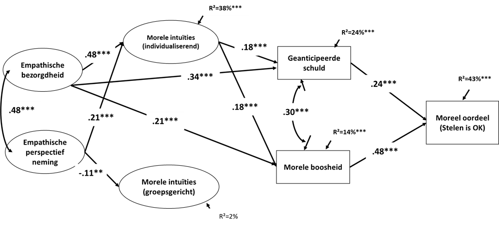

Hieronder zie je een **padmodel** over moreel oordelen bij diefstal (De Buck & Pauwels, 2022). Voor elke endogene en intermediaire variabele wordt de R² (verklaarde variantie) vermeld.

---

Welk percentage van de variantie in **"Moreel oordeel (Stelen is OK)"** wordt **NIET** verklaard door het model?

1. 38%
2. 43%
3. 57%
4. 62%

**Hint:** *Zoek de R² van de uitkomstvariabele 'Moreel oordeel' op in het padmodel. De NIET-verklaarde variantie is 100% min de verklaarde variantie.*

- Typ je antwoord als één enkel getal (1-4) om je keuze aan te geven