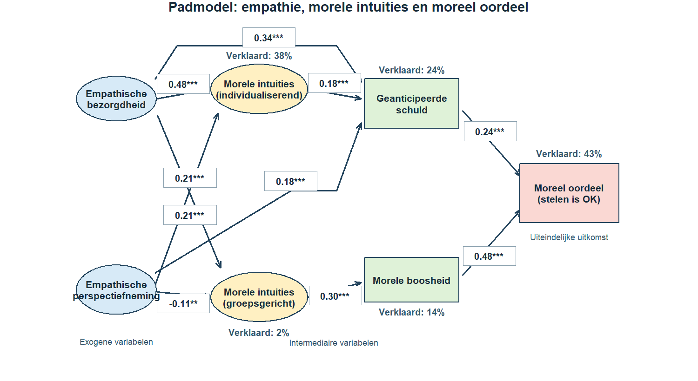

Gebruik het vereenvoudigde padmodel over empathie en moreel oordeel.

**Leerdoel:** R² in een padmodel aflezen, het onverklaarde aandeel berekenen en dat aandeel voorzichtig interpreteren.

Beantwoord de drie vragen.

1. Hoeveel procent van de variatie in morele intuïties (groepsgericht) verklaren de twee empathiedimensies?
2. Voor de uiteindelijke uitkomst is R² = 43%. Hoeveel procent blijft onverklaard?
3. Wat ondersteunt 57% onverklaarde variantie? Gebruik 1 = meetfouten zijn bewezen; 2 = niet-gemeten variabelen kunnen eveneens bijdragen en ontbreken in dit model; 3 = alle padcoëfficiënten zijn te klein; of 4 = het model bevat aantoonbaar te veel variabelen.

Vul de twee percentages als gehele getallen en daarna de antwoordcode in.
