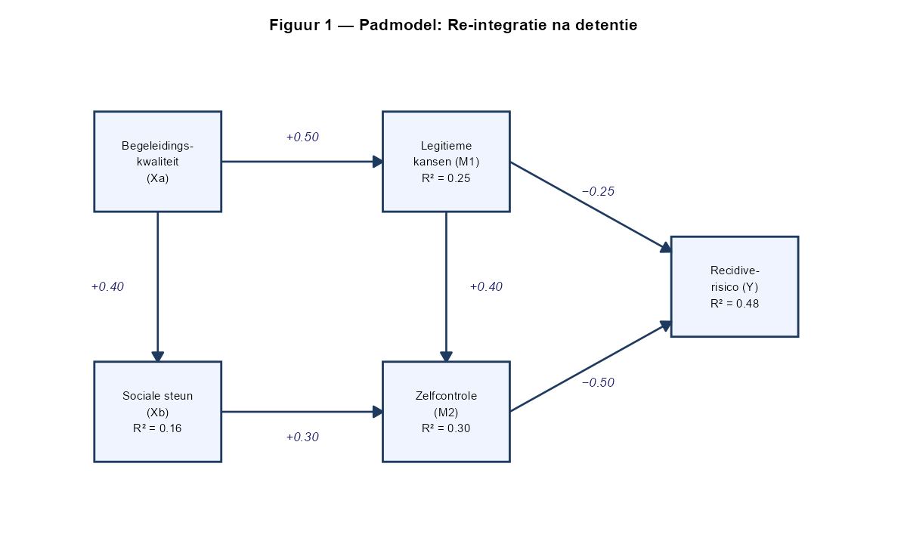

Onderzoekers bestuderen hoe **begeleidingskwaliteit** (de kwaliteit van de begeleiding tijdens re-integratie na detentie) bijdraagt aan het verminderen van recidiverisico. Op basis van sociale controletheorie en de sociale leertheorie stellen zij dat begeleidingskwaliteit de sociale steun in het netwerk van de ex-gedetineerde versterkt en de toegang tot legitieme kansen (bv. werk, huisvesting) vergroot. Meer legitieme kansen en sterkere sociale steun vergroten op hun beurt de zelfcontrole, en zowel legitieme kansen als zelfcontrole verlagen het recidiverisico.

Figuur 1 toont het bijbehorende padmodel. **Er is geen directe pijl van 'Begeleidingskwaliteit' naar 'Recidiverisico'.**

---

Hoeveel bedraagt het **totale effect** van **'Begeleidingskwaliteit' (Xa)** op **'Recidiverisico' (Y)**?

*(Ronde tussenberekeningen op 4 decimalen; geef het eindresultaat op 3 decimalen.)*

1. −0.285
2. −0.125
3. −0.225
4. −0.060

**Hint:** *Omdat er geen directe pijl loopt van Xa naar Y, is het totale effect gelijk aan de som van alle indirecte routes. Identificeer eerst alle mogelijke routes van Xa naar Y en vermenigvuldig voor elke route de padcoëfficiënten langs die route.*

- Typ je antwoord als één enkel getal (1-4) om je keuze aan te geven
