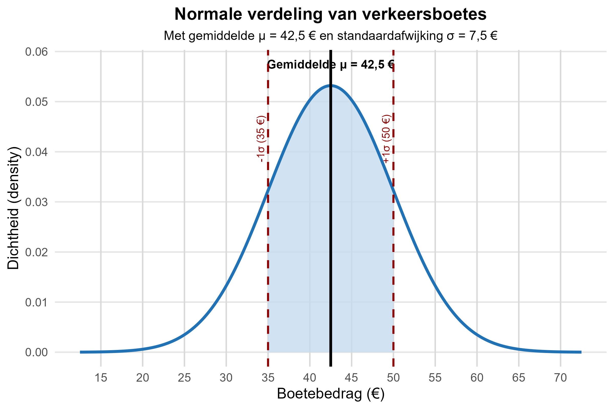

Een criminoloog onderzoekt de verdeling van verkeersboetes die door de politie worden opgelegd in een bepaalde regio van België. Na analyse van een grote dataset van 10.000 verkeersboetes blijkt dat deze **normaal verdeeld** zijn.

**gegevens:**
- **Gemiddelde boete (μ):** 42,5€
- **Standaardafwijking (σ):** 7,5€
- **Verdeling:** Normale verdeling

De onderzoeker wil nu specifieke kansen berekenen om beter te begrijpen hoe verkeersboetes verdeeld zijn en wat de waarschijnlijkheid is dat een willekeurige overtreder een boete binnen bepaalde bedragscategorieën krijgt.

**Formules**

**Z-score berekening:**
$$Z = \frac{X - \mu}{\sigma}$$

**Waarschijnlijkheden:**
- P(Z ≤ z) kan je opzoeken in de standaardnormale tabel
- P(Z ≥ z) = 1 - P(Z ≤ z)
- P(a ≤ X ≤ b) = P(Z ≤ z_b) - P(Z ≤ z_a)

**📊 Volledige Z-score tabel:** <a href='https://www.belfactorij.nl/voorinloggen/kansverdelingen/Normaal.htm' target='_blank' rel='noopener noreferrer'>Standaardnormale verdeling tabel</a>

**Vragen**

**a) Wat is de kans dat een willekeurige overtreder een boete dient te betalen tussen de 20€ en 25€?**

- **Stap 1:** Bereken de Z-scores voor beide grenzen
- **Stap 2:** Zoek de kansen op in de standaardnormale tabel
- **Stap 3:** Bereken het verschil

Geef je antwoord als **percentage** (bijvoorbeeld: 12.34)

**b) Wat is de kans dat een willekeurige overtreder een boete dient te betalen lager dan 32€?**

- **Stap 1:** Bereken de Z-score voor X = 32
- **Stap 2:** Zoek P(Z ≤ z) op in de standaardnormale tabel  
- **Stap 3:** Zet om naar percentage
Geef je antwoord als **percentage** (bijvoorbeeld: 15.67)

**c) Wat is de kans dat een willekeurige overtreder een boete dient te betalen hoger dan 29€?**

- **Stap 1:** Bereken de Z-score voor X = 29
- **Stap 2:** Zoek P(Z ≤ z) op in de standaardnormale tabel
- **Stap 3:** Bereken het complement: 1 - P(Z ≤ z)
- **Stap 4:** Zet om naar percentage

Geef je antwoord als **percentage** (bijvoorbeeld: 78.92)

## **Instructies**

- Vervang "???" door het juiste antwoord
- Gebruik decimalen met **punt** (geen komma)
- Rond af tot op twee decimalen waar nodig
