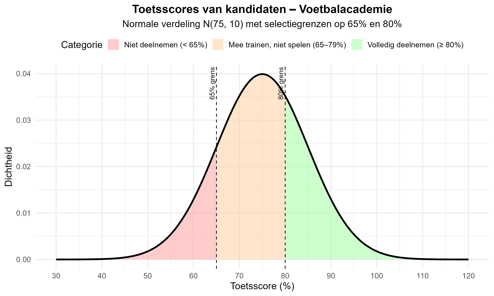

Een Europese voetbalacademie selecteert eerstejaars spelers op basis van hun schoolprestaties en toetsscores. De academie hanteert de volgende regels vergelijkbaar met de Amerikaanse NCAA (National Collegiate Athletic Association):

- **Volledige deelname aan wedstrijden:** toetsresultaat van 80% of hoger
- **Mee trainen en studiebeurs ontvangen, maar niet spelen:** toetsresultaat tussen 65% en 79%  
- **Niet deelnemen:** minder dan 65%

**Onderzoeksgegevens:**
- **Gemiddelde toetsscore (μ):** 75%
- **Standaardafwijking (σ):** 10%
- **Verdeling:** Normale verdeling N(75, 10)

*De afbeelding toont de normale verdeling van toetsscores met de drie categorieën: rood (niet deelnemen < 65%), oranje (mee trainen 65-79%), en groen (volledig deelnemen ≥ 80%).*

**Formules**

**Z-score berekening:**
$$Z = \frac{X - \mu}{\sigma}$$

**Waarschijnlijkheden:**
- P(Z ≤ z) kan je opzoeken in de standaardnormale tabel
- P(Z ≥ z) = 1 - P(Z ≤ z)
- P(a ≤ X ≤ b) = P(Z ≤ z_b) - P(Z ≤ z_a)

**📊 Volledige Z-score tabel:** <a href='https://www.belfactorij.nl/voorinloggen/kansverdelingen/Normaal.htm' target='_blank' rel='noopener noreferrer'>Standaardnormale verdeling tabel</a>

**Vragen**

**a) Bereken de Z-scores voor de toetsscores van 65% en 80%.**

- *Stap 1:* Gebruik de formule Z = (X - μ) / σ
- *Stap 2:* Substituteer de waarden voor beide scores
- *Stap 3:* Bereken beide Z-scores

Geef je antwoorden als **decimalen** (bijvoorbeeld: -1.0 en 0.5)

**b) Bepaal het percentage kandidaten dat een score tussen 65% en 79% heeft (mogen trainen maar niet spelen).**

- *Stap 1:* Bereken Z-scores voor beide grenswaarden
- *Stap 2:* Zoek de kansen op in de standaardnormale tabel
- *Stap 3:* Bereken het verschil tussen de twee kansen

Geef je antwoord als **percentage** (bijvoorbeeld: 53.28)

**c) Bepaal het percentage kandidaten dat een score van 80% of hoger heeft (mogen volledig spelen).**

- *Stap 1:* Bereken Z-score voor de grenswaarde
- *Stap 2:* Zoek de kans op in de standaardnormale tabel  
- *Stap 3:* Bereken het complement (rechterstaartkans)

Geef je antwoord als **percentage** (bijvoorbeeld: 30.85)

**d) Als de academie 50 eerstejaars spelers aanneemt, hoeveel van hen mogen alleen trainen en hoeveel mogen volledig spelen?**

- *Stap 1:* Gebruik de percentages uit vraag b en c
- *Stap 2:* Alleen trainen: 50 × (percentage uit vraag b) / 100
- *Stap 3:* Volledig spelen: 50 × (percentage uit vraag c) / 100

Geef je antwoorden als **hele getallen** (bijvoorbeeld: 27 en 15)

