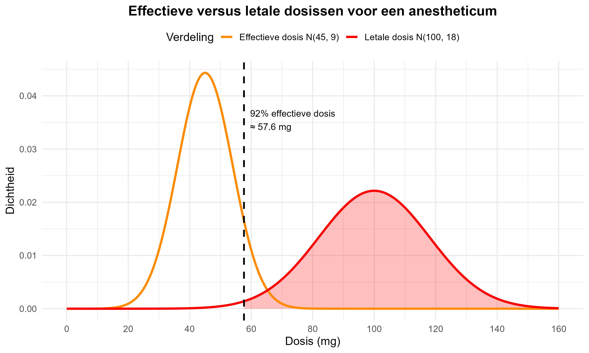

De dosis van een nieuw anestheticum die nodig is om een patiënt onder narcose te brengen is **normaal verdeeld** met gemiddelde μ = 45 mg en standaardafwijking σ = 9 mg. De letale dosis van dit anestheticum is ook **normaal verdeeld** met gemiddelde μ = 100 mg en standaardafwijking σ = 18 mg.

Een arts wil een dosis toedienen die bij 92% van de patiënten effectief is voor anesthesie.

**Onderzoeksgegevens:**
- **Effectieve dosis:** N(45, 9) mg  
- **Letale dosis:** N(100, 18) mg
- **Gewenste effectiviteit:** 92% van de patiënten

*De afbeelding toont de effectieve dosis N(45,9) in oranje en letale dosis N(100,18) in rood. Het rode gebied rechts van de gestreepte lijn (92% effectieve dosis ≈ 57.6 mg) toont het mortaliteitsrisico.*

**Formules**

**Z-score berekening:**
$$Z = \frac{X - \mu}{\sigma}$$

**Waarschijnlijkheden:**
- P(Z ≤ z) kan je opzoeken in de standaardnormale tabel
- P(Z ≥ z) = 1 - P(Z ≤ z)

**📊 Volledige Z-score tabel:** [Standaardnormale verdeling tabel](https://www.belfactorij.nl/voorinloggen/kansverdelingen/Normaal.htm)

**Vraag**

**Wat is het verwachte sterftepercentage bij het toedienen van een dosis die 92% van de patiënten effectief anesthesieert?**

**Stappen:**
1. Bepaal de dosis die bij 92% van de patiënten effectief is
2. Bereken de kans dat deze dosis letaal is

**Maak een keuze:**
1. 0.3%
2. 0.9%  
3. 1.4%
4. 2.8%

Typ je antwoord als één enkel getal (1-4) om je keuze aan te geven.