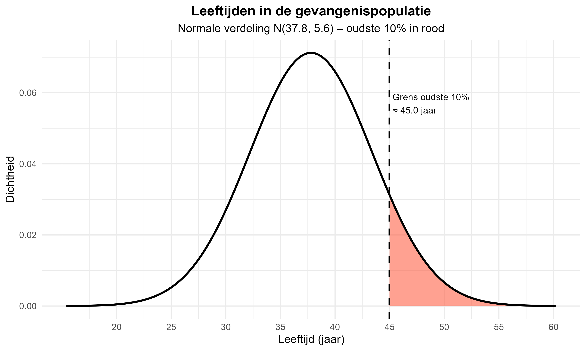

**Een gevangenisdirecteur wil een bevraging organiseren bij de oudste 10% van de gevangenispopulatie. De leeftijden in de gevangenis zijn normaal verdeeld, met gemiddelde 37.8 jaar en een standaardafwijking 5.6 jaar. Vanaf welke leeftijd zullen de gevangenen aan de bevraging kunnen deelnemen?**

**Onderzoeksgegevens:**
- **Gemiddelde leeftijd (μ):** 37.8 jaar
- **Standaardafwijking (σ):** 5.6 jaar  
- **Verdeling:** Normale verdeling N(37.8, 5.6)
- **Gezocht:** Oudste 10% (90ste percentiel)

*De afbeelding toont de normale verdeling van leeftijden in de gevangenispopulatie. Het rode gebied rechts van de gestreepte lijn toont de oudste 10% (≈ 45 jaar en ouder).*

> **Hint:** Denk na over percentielberekeningen bij een normale verdeling - je zoekt het punt waarbij 90% van de populatie jonger is.

1. De gevangenen vanaf de leeftijd van (afgerond) 42.5 jaar
2. De gevangenen vanaf de leeftijd van (afgerond) 47 jaar  
3. De gevangenen vanaf de leeftijd van (afgerond) 50 jaar
4. De gevangenen vanaf de leeftijd van (afgerond) 45 jaar
5. We kunnen dit niet berekenen bij een gebrek aan gegevens

Typ je antwoord als één enkel getal (1-5) om je keuze aan te geven.
