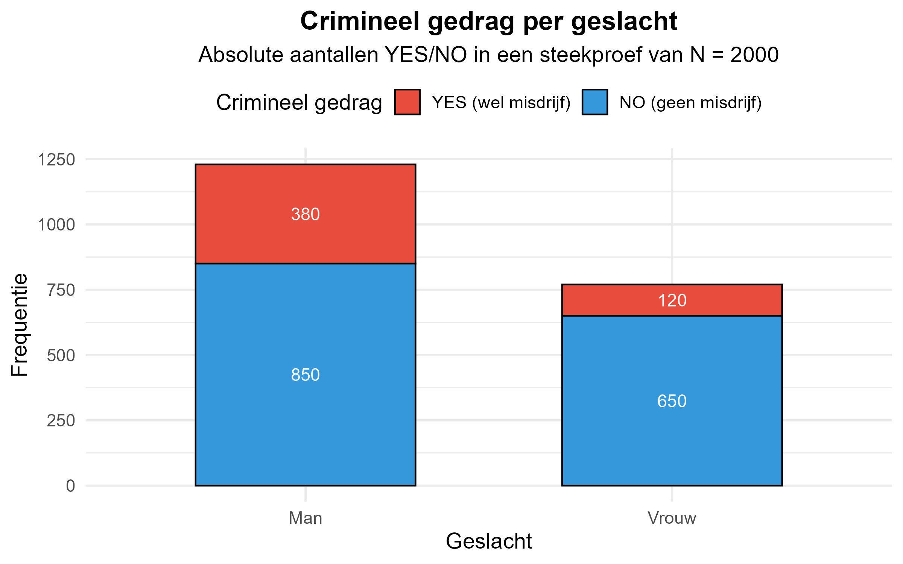

Een onderzoeker wil nagaan of er een verband is tussen **geslacht** en **crimineel gedrag** (wel/geen misdrijf gepleegd). In een representatieve steekproef van **2.000** volwassenen werd het volgende gevonden:

**Tabel 1**

*Crimineel gedrag per geslacht (absolute frequenties)*

<table style="border-collapse: collapse; width: 45%; margin: 20px auto; font-family: Times, serif;">
<thead>
<tr style="border-top: 2px solid #000; border-bottom: 2px solid #000;">
<th style="padding: 6px 8px; text-align: left; font-weight: bold;">Crimineel gedrag</th>
<th style="padding: 6px 8px; text-align: center; font-weight: bold;">Man</th>
<th style="padding: 6px 8px; text-align: center; font-weight: bold;">Vrouw</th>
</tr>
</thead>
<tbody>
<tr>
<td style="padding: 4px 8px; text-align: left;">YES</td>
<td style="padding: 4px 8px; text-align: center;">380</td>
<td style="padding: 4px 8px; text-align: center;">120</td>
</tr>
<tr style="border-bottom: 2px solid #000;">
<td style="padding: 4px 8px; text-align: left;">NO</td>
<td style="padding: 4px 8px; text-align: center;">850</td>
<td style="padding: 4px 8px; text-align: center;">650</td>
</tr>
</tbody>
</table>

Je berekent alles **met de hand** (rekenmachine mag). Dit is deel 1 van de oefening. Hier oefen je het onderscheid tussen marginale en conditionele percentages.

## Opdrachten

1. Bereken de marginale percentages ten opzichte van **N = 2000**:
   - `percentage_mannen`
   - `percentage_vrouwen`
   - `percentage_yes`
   - `percentage_no`
2. Bereken de kolompercentages:
   - `percentage_yes_bij_mannen`
   - `percentage_yes_bij_vrouwen`
3. Bereken `percentageverschil_yes`: het conditionele YES-percentage bij mannen **min** het conditionele YES-percentage bij vrouwen, uitgedrukt in procentpunten.

Rond alle percentages af op **2 decimalen**. Gebruik een punt als decimaalteken en noteer geen procentteken.

