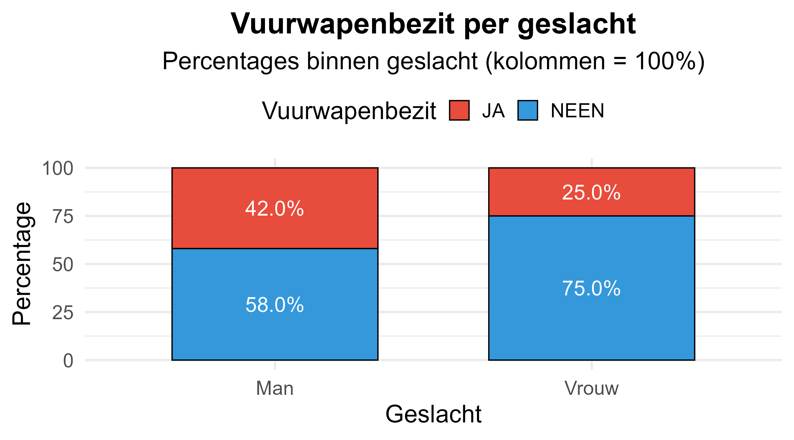

Is er een verband tussen **vuurwapenbezit** en **biologisch geslacht**?

In een hypothetisch onderzoek wordt aan **817 mannen** en **1040 vrouwen** gevraagd of zij een vuurwapen bezitten. De onderzoeker wil weten of er een verband bestaat tussen het bezit van een vuurwapen en biologisch geslacht.

Opgelet: bepaal vooraf welke variabele je inhoudelijk als **onafhankelijk** beschouwt en welke als **afhankelijk**. Plaats de onafhankelijke variabele in de **kolommen** (kolomvariabele) en de afhankelijke variabele in de **rijen** (rijvariabele).

**Tabel 1**

*Vuurwapenbezit (rijen) per geslacht (kolommen) - absolute frequenties*

<table style="border-collapse: collapse; width: 55%; margin: 20px auto; font-family: Times, serif;">
<thead>
<tr style="border-top: 2px solid #000; border-bottom: 2px solid #000;">
<th style="padding: 6px 8px; text-align: left; font-weight: bold;">Vuurwapenbezit</th>
<th style="padding: 6px 8px; text-align: center; font-weight: bold;">Man</th>
<th style="padding: 6px 8px; text-align: center; font-weight: bold;">Vrouw</th>
</tr>
</thead>
<tbody>
<tr>
<td style="padding: 4px 8px; text-align: left;">JA</td>
<td style="padding: 4px 8px; text-align: center;">343</td>
<td style="padding: 4px 8px; text-align: center;">260</td>
</tr>
<tr style="border-bottom: 2px solid #000;">
<td style="padding: 4px 8px; text-align: left;">NEEN</td>
<td style="padding: 4px 8px; text-align: center;">474</td>
<td style="padding: 4px 8px; text-align: center;">780</td>
</tr>
</tbody>
</table>

Je berekent alles **met de hand** (rekenmachine mag). In R vul je enkel je **eindresultaten** in.

## Opdrachten

1) **Bereken het relevante percentageverschil (in procentpunten).**

Omdat geslacht de onafhankelijke variabele is, werk je met **kolompercentages** (elke kolom = 100%):
- `percentage_ja_bij_mannen` = (JA bij mannen / totaal mannen) * 100
- `percentage_ja_bij_vrouwen` = (JA bij vrouwen / totaal vrouwen) * 100
- `percentageverschil_ja` = percentage_ja_bij_mannen - percentage_ja_bij_vrouwen

2) **Bereken chi^2** (chi-kwadraat) voor deze kruistabel.
- Verwachte frequentie per cel: `E_ij = (rijtotaal_i * kolomtotaal_j) / N`
- Daarna sommeer je over alle cellen: `(O - E)^2 / E`
- Noteer je resultaat als `chi_kwadraat`

3) **Welke associatiemaat gebaseerd op chi^2 kan je bijkomend berekenen (2x2 tabel)?**
- Vul je keuze in als `associatiemaat_mc` (A=1, B=2, C=3, D=4)

4) **Bereken de waarde van die associatiemaat en interpreteer.**
- Voor een 2x2 tabel kan je (onder meer) werken met: `phi = sqrt(chi^2 / N)`
- Vul in:
  - `phi`
  - `interpretatie_phi_mc` (A=1: zwak, B=2: matig, C=3: sterk)

Afronden: percentages op 2 decimalen, chi^2 op 2 decimalen, phi op 2 decimalen.

**Instructie:** In de boilerplate vervang je `???` door je antwoord. Gebruik decimalen met punt (niet komma) en geen procentteken.

