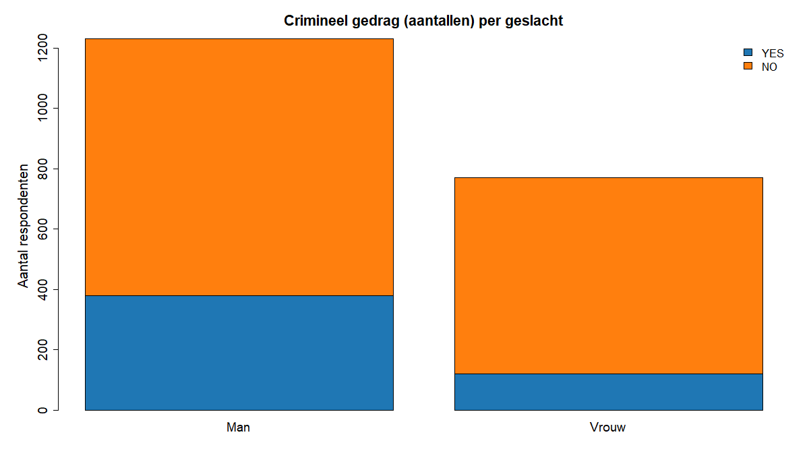

Een onderzoeker wil nagaan of er een verband is tussen **geslacht** en **crimineel gedrag** (wel/geen misdrijf gepleegd). In een representatieve steekproef van **2.000** volwassenen werd het volgende gevonden:

| Crimineel gedrag | Man | Vrouw |
|---|---:|---:|
| YES | 380 | 120 |
| NO  | 850 | 650 |

Je berekent alles **met de hand** (rekenmachine mag). In R vul je enkel je **eindresultaten** in (geen R-berekeningen nodig).

## Opdrachten (vul de variabelen in de boilerplate)
1) Marginale percentages (t.o.v. N = 2000)
- `percentage_mannen` = (totaal mannen / 2000) * 100
- `percentage_vrouwen` = (totaal vrouwen / 2000) * 100
- `percentage_yes` = (totaal YES / 2000) * 100
- `percentage_no` = (totaal NO / 2000) * 100

2) Conditionele percentages (kolompercentages)
- `percentage_yes_bij_mannen` = (YES bij mannen / totaal mannen) * 100
- `percentage_yes_bij_vrouwen` = (YES bij vrouwen / totaal vrouwen) * 100

3) Percentageverschil (procentpunten)
- `percentageverschil_yes` = percentage_yes_bij_mannen - percentage_yes_bij_vrouwen

4) Odds en odds ratio
- `odds_mannen` = (YES bij mannen) / (NO bij mannen)
- `odds_vrouwen` = (YES bij vrouwen) / (NO bij vrouwen)
- `odds_ratio` = odds_mannen / odds_vrouwen

5) Chi-kwadraat (chi^2)
- Verwachte frequentie: `E_ij = (rijtotaal_i * kolomtotaal_j) / N`
- Daarna: `chi^2 = Σ (O - E)^2 / E`
- Noteer het resultaat als `chi_kwadraat`

6) Extra + meerkeuze
- `kans_no_bij_vrouwen` = P(NO | Vrouw) = (NO bij vrouwen) / (totaal vrouwen)
- Meerkeuze: "Wat is de kans dat een willekeurige vrouw **geen** misdrijf pleegde?"
  - A. 30%
  - B. 15%
  - C. 85%
  - D. 6%
  - Zet je keuze in `antwoord_mc` (A=1, B=2, C=3, D=4)

Afronden: percentages op 2 decimalen, odds op 4 decimalen, OR op 2 decimalen, chi^2 op 4 decimalen.
