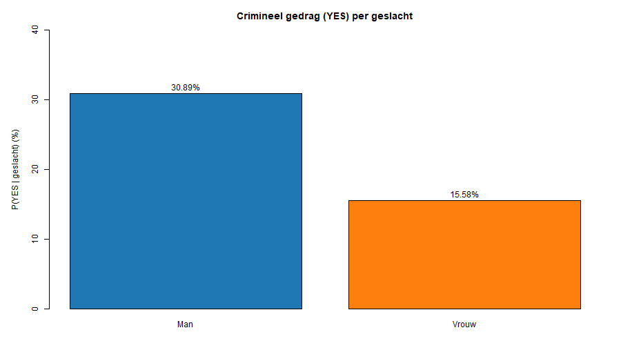

Een onderzoeker wil nagaan of er een verband is tussen **geslacht** en **crimineel gedrag** (wel/geen misdrijf gepleegd). In een representatieve steekproef van **2.000** volwassenen werd het volgende gevonden:

| Crimineel gedrag | Man | Vrouw |
|---|---:|---:|
| YES | 380 | 120 |
| NO  | 850 | 650 |

In deze oefening bereken je (1) **marginale percentages**, (2) **conditionele percentages**, en (3) enkele **associatiematen** (odds ratio en chi-kwadraat) op basis van deze kruistabel.

## Stap 1 — Marginale verdelingen (t.o.v. N = 2000)
Bereken de marginale percentages:
- **Percentage mannen** = 1230/2000 × 100
- **Percentage vrouwen** = 770/2000 × 100
- **Percentage YES** = 500/2000 × 100
- **Percentage NO** = 1500/2000 × 100

## Stap 2 — Conditionele verdelingen (kolompercentages)
Bereken binnen elk geslacht welk percentage **YES** is:
- \(P(YES\\,|\\,Man)\) = 380/1230 × 100
- \(P(YES\\,|\\,Vrouw)\) = 120/770 × 100

## Stap 3 — Percentageverschil (procentpunten)
Het relevante percentageverschil bij een theoretisch **asymmetrische** relatie bereken je met **kolompercentages** (kolommen = 100%):
**Percentageverschil (in procentpunten)** = \(P(YES\\,|\\,Man) - P(YES\\,|\\,Vrouw)\)

## Stap 4 — Odds en odds ratio (OR)
- **Odds** (YES vs. NO) bij mannen: 380/850  
- **Odds** (YES vs. NO) bij vrouwen: 120/650  
- **Odds ratio**: \(OR = (odds\\ mannen) / (odds\\ vrouwen)\)

## Stap 5 — Chi-kwadraat (\u03C7²)
Bereken de verwachte frequenties met:
- \(E_{ij} = (rijtotaal_i \\times kolomtotaal_j) / N\)

en sommeer vervolgens:
- \u03C7² = \u03A3 (O − E)² / E

## Stap 6 — Extra vraag + meerkeuze
Bereken:
- \(P(NO\\,|\\,Vrouw) = 650/770\)

Meerkeuze: “Wat is de kans dat een willekeurige vrouw **geen** misdrijf pleegde?”
- A. 30%
- B. 15%
- C. 85%
- D. 6%

## Wat moet je indienen in R?
Vul de variabelen in de boilerplate in. De namen zijn bewust **voluit** geschreven:

| Grootheid | Variabele | Eenheid |
|---|---|---|
| % mannen (marginaal) | `percentage_mannen` | % |
| % vrouwen (marginaal) | `percentage_vrouwen` | % |
| % YES (marginaal) | `percentage_yes` | % |
| % NO (marginaal) | `percentage_no` | % |
| % YES bij mannen | `percentage_yes_bij_mannen` | % |
| % YES bij vrouwen | `percentage_yes_bij_vrouwen` | % |
| verschil in procentpunten | `percentageverschil_yes` | procentpunten |
| odds mannen (YES/NO) | `odds_mannen` | odds |
| odds vrouwen (YES/NO) | `odds_vrouwen` | odds |
| odds ratio | `odds_ratio` | OR |
| chi-kwadraat | `chi_kwadraat` | \u03C7² |
| P(NO \u007c Vrouw) | `kans_no_bij_vrouwen` | kans (0–1) of % |
| meerkeuze (A=1,B=2,C=3,D=4) | `antwoord_mc` | 1–4 |

**Afronden:** rond percentages af op 2 decimalen, odds op 4 decimalen, OR op 2 decimalen en \u03C7² op 4 decimalen.
