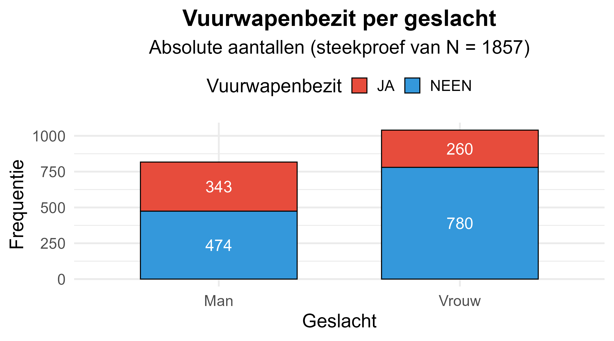

Is er een verband tussen **vuurwapenbezit** en **biologisch geslacht**?

In een hypothetisch onderzoek wordt aan **817 mannen** en **1040 vrouwen** gevraagd of zij een vuurwapen bezitten. De onderzoeker wil weten of er een verband bestaat tussen het bezit van een vuurwapen en biologisch geslacht.

Opgelet: bepaal vooraf welke variabele je inhoudelijk als **onafhankelijk** beschouwt en welke als **afhankelijk**. Plaats de onafhankelijke variabele in de **kolommen** (kolomvariabele) en de afhankelijke variabele in de **rijen** (rijvariabele).

**Tabel 1**

*Vuurwapenbezit (rijen) per geslacht (kolommen) - absolute frequenties*

<table style="border-collapse: collapse; width: 55%; margin: 20px auto; font-family: Times, serif;">
<thead>
<tr style="border-top: 2px solid #000; border-bottom: 2px solid #000;">
<th style="padding: 6px 8px; text-align: left; font-weight: bold;">Vuurwapenbezit</th>
<th style="padding: 6px 8px; text-align: center; font-weight: bold;">Man</th>
<th style="padding: 6px 8px; text-align: center; font-weight: bold;">Vrouw</th>
</tr>
</thead>
<tbody>
<tr>
<td style="padding: 4px 8px; text-align: left;">JA</td>
<td style="padding: 4px 8px; text-align: center;">343</td>
<td style="padding: 4px 8px; text-align: center;">260</td>
</tr>
<tr style="border-bottom: 2px solid #000;">
<td style="padding: 4px 8px; text-align: left;">NEEN</td>
<td style="padding: 4px 8px; text-align: center;">474</td>
<td style="padding: 4px 8px; text-align: center;">780</td>
</tr>
</tbody>
</table>

## **Opdrachten**

1. Bereken het percentage vuurwapenbezit bij mannen en bij vrouwen.
2. Bereken het relevante percentageverschil in procentpunten.
3. Bereken de chi-kwadraatwaarde voor de kruistabel.
4. Kies de passende associatiemaat voor deze 2×2-tabel.
5. Bereken die associatiemaat en interpreteer haar sterkte.

Gebruik in het antwoordbestand de aangegeven variabelen en optienummers. De uitleg bij de feedback helpt je achteraf om je berekening te controleren.

Afronden: percentages op 2 decimalen, chi^2 op 2 decimalen, phi op 2 decimalen.

