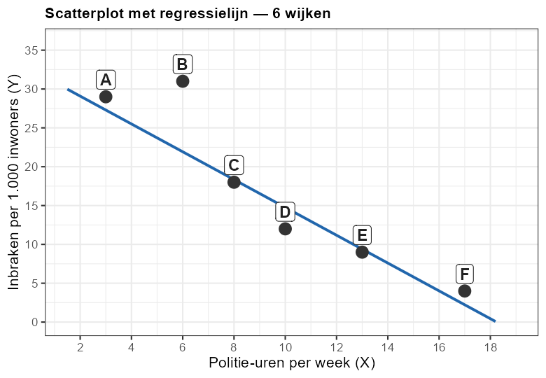

Een criminoloog onderzoekt de relatie tussen **politie-aanwezigheid (X)** en **inbraken (Y)** in 6 wijken.
De variabelen zijn:
- **X** = gemiddeld aantal politie-uren per week
- **Y** = aantal inbraken per 1.000 inwoners per jaar

---

Bekijk de onderstaande scatterplot. De regressielijn is ingetekend.



Welk gelabeld punt heeft het **grootste residu** ten opzichte van de regressielijn?

Het residu van een punt = werkelijke Y − voorspelde Y op de lijn.
Het punt met het grootste (absolute) residu wijkt het sterkst af van de regressielijn.

> **Let op:** het punt met de hoogste Y-waarde of de extremeenste X-waarde is
> **niet** automatisch het punt met het grootste residu.

Geef de letter in als tekst, bijv. `"A"`.

```r
uitbijter <- ???   # letter van het punt met het grootste residu
```
