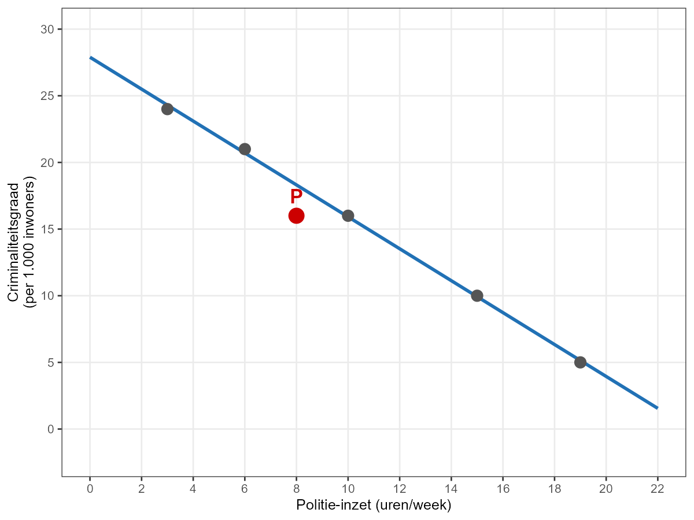

In een criminologische studie wordt de relatie tussen **politie-inzet (X)** en **criminaliteitsgraad (Y)** gemodelleerd via enkelvoudige OLS-regressie. De scatterplot toont de geschatte regressielijn en observatie **P** (rood aangeduid).



Bepaal de ligging van observatie P ten opzichte van de regressielijn:

| Code | Ligging |
|------|---------|
| 1 | boven de regressielijn |
| 2 | op de regressielijn |
| 3 | onder de regressielijn |

```r
punt_positie <- ???
```
