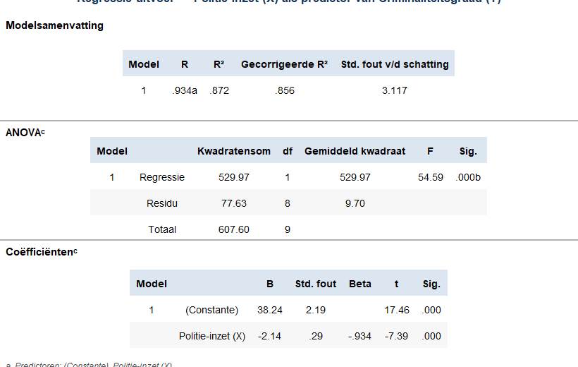

Onderstaande tabel geeft de uitvoer van een enkelvoudige OLS-regressieanalyse voor de relatie tussen **politie-inzet (X)** en **criminaliteitsgraad (Y)** in 10 stedelijke wijken.

Welk percentage van de variantie in Y wordt verklaard door het regressiemodel?

Voer uw antwoord in als een geheel getal.