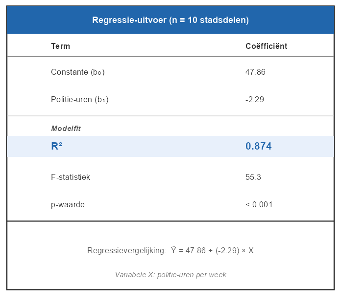

# Oef - 8.7: R² omzetten naar een percentage

Een criminoloog voert een regressieanalyse uit op data van **10 stadsdelen**.
De variabelen zijn:
- **X** = gemiddeld aantal politie-uren per week
- **Y** = aantal inbraken per 1.000 inwoners per jaar

---

Bekijk het onderstaande regressieoverzicht.



De tabel toont de waarde van R² als **decimaal getal**.

**Bereken** hoeveel procent van de variantie in het inbraakcijfer verklaard
wordt door het aantal politie-uren.
Rond af naar een **geheel getal** (bijv. `74` voor 74%).

> **Tip:** R² als percentage = R² × 100, afgerond naar een geheel getal.

```r
r_kwadraat_pct <- ???   # geheel getal in procenten (bijv. 74)
```
