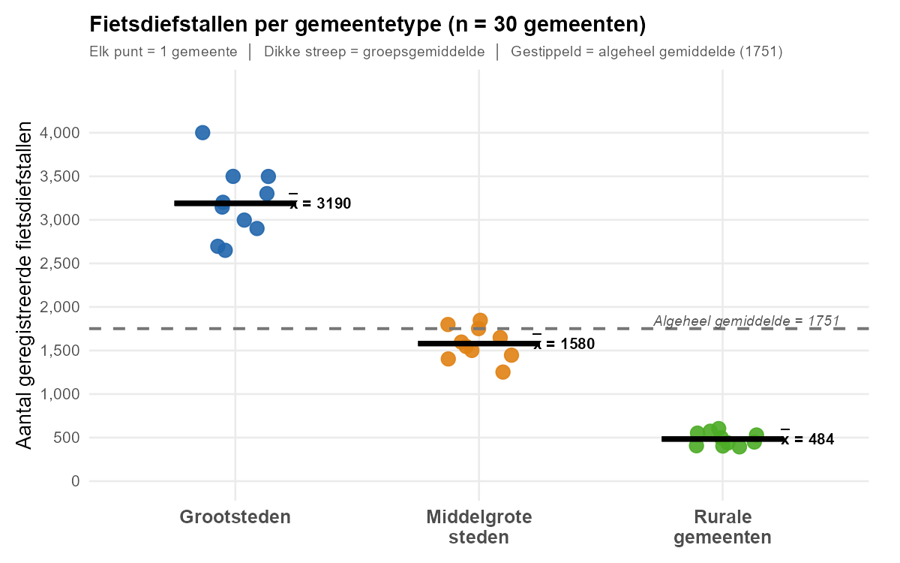

## Oef - 9.4: Variantieanalyse (ANOVA) - Fietsdiefstallen naar gemeentetype

In onderstaande tabel zie je het **aantal geregistreerde fietsdiefstallen** in **30 Belgische gemeenten** in 2008, opgesplitst naar gemeentetype.

**Tabel 1**

*Geregistreerde fietsdiefstallen per gemeente (per gemeentetype)*

<table style="border-collapse: collapse; width: 65%; margin: 20px auto; font-family: Times, serif;">
<thead>
<tr style="border-top: 2px solid #000; border-bottom: 1px solid #000;">
<th style="padding: 6px 12px; text-align: center; font-weight: bold;">Grootsteden</th>
<th style="padding: 6px 12px; text-align: center; font-weight: bold;">Middelgrote steden</th>
<th style="padding: 6px 12px; text-align: center; font-weight: bold;">Rurale gemeenten</th>
</tr>
</thead>
<tbody>
<tr><td style="padding: 4px 12px; text-align: center;">3500</td><td style="padding: 4px 12px; text-align: center;">1850</td><td style="padding: 4px 12px; text-align: center;">400</td></tr>
<tr><td style="padding: 4px 12px; text-align: center;">2700</td><td style="padding: 4px 12px; text-align: center;">1650</td><td style="padding: 4px 12px; text-align: center;">450</td></tr>
<tr><td style="padding: 4px 12px; text-align: center;">2900</td><td style="padding: 4px 12px; text-align: center;">1450</td><td style="padding: 4px 12px; text-align: center;">500</td></tr>
<tr><td style="padding: 4px 12px; text-align: center;">3200</td><td style="padding: 4px 12px; text-align: center;">1600</td><td style="padding: 4px 12px; text-align: center;">550</td></tr>
<tr><td style="padding: 4px 12px; text-align: center;">3150</td><td style="padding: 4px 12px; text-align: center;">1550</td><td style="padding: 4px 12px; text-align: center;">390</td></tr>
<tr><td style="padding: 4px 12px; text-align: center;">3300</td><td style="padding: 4px 12px; text-align: center;">1800</td><td style="padding: 4px 12px; text-align: center;">530</td></tr>
<tr><td style="padding: 4px 12px; text-align: center;">2650</td><td style="padding: 4px 12px; text-align: center;">1400</td><td style="padding: 4px 12px; text-align: center;">410</td></tr>
<tr><td style="padding: 4px 12px; text-align: center;">4000</td><td style="padding: 4px 12px; text-align: center;">1750</td><td style="padding: 4px 12px; text-align: center;">440</td></tr>
<tr><td style="padding: 4px 12px; text-align: center;">3500</td><td style="padding: 4px 12px; text-align: center;">1250</td><td style="padding: 4px 12px; text-align: center;">570</td></tr>
<tr style="border-bottom: 2px solid #000;"><td style="padding: 4px 12px; text-align: center;">3000</td><td style="padding: 4px 12px; text-align: center;">1500</td><td style="padding: 4px 12px; text-align: center;">600</td></tr>
</tbody>
</table>

**Figuur 1** — *Spreiding van fietsdiefstallen per gemeente, met groepsgemiddelden*

> De drie groepen overlappen **niet**. Let op de spreiding binnen elke groep en de afstand tussen de groepen.

**F-tabel**

Je berekent alles **met de hand** (rekenmachine mag). In R vul je enkel je **eindresultaten** in.

---

## **Onderzoeksvragen**
- Is er een verband tussen het gemeentetype en het aantal fietsdiefstallen?
- Hoe sterk is het verband?
- Is dit verband statistisch significant?

---

## **ANOVA-berekeningsstappen**

1. Bereken het **groepsgemiddelde** per gemeentetype
2. Bereken de **binnengroepsvariatie per groep**: `SS_g = som van (x_i - x̄_g)^2`
3. Bereken de **totale binnengroepsvariatie**: `SS_within = som van alle SS_g`
4. Bepaal `df_within = N - k` (N = totale n, k = aantal groepen)
5. Bereken `MS_within = SS_within / df_within`
6. Bereken de **totale tussengroepsvariatie**: `SS_between = som van n_g * (x̄_g - x̄_grand)^2`
7. Bepaal `df_between = k - 1`
8. Bereken `MS_between = SS_between / df_between`
9. Bereken de **F-ratio**: `F = MS_between / MS_within`
10. Bereken eta-kwadraat: `eta^2 = SS_between / SS_total`

---

## **Opgaven**

### **Deel A: Beschrijvende statistieken**

- 1) **Gemiddelde fietsdiefstallen – Grootsteden**
   - `gemiddelde_groot` (geheel getal)

- 2) **Gemiddelde fietsdiefstallen – Middelgrote steden**
   - `gemiddelde_middel` (geheel getal)

- 3) **Gemiddelde fietsdiefstallen – Rurale gemeenten**
   - `gemiddelde_ruraal` (geheel getal)

- 4) **Grand mean (gemiddelde over alle 30 gemeenten)**
   - `grand_mean` (rond af op 2 decimalen)

### **Deel B: Binnengroepsvariatie (SSwithin)**

- 5) **SS within – Grootsteden**
   - `SS_within_groot` (geheel getal)

- 6) **SS within – Middelgrote steden**
   - `SS_within_middel` (geheel getal)

- 7) **SS within – Rurale gemeenten**
   - `SS_within_ruraal` (geheel getal)

- 8) **Totale SS within**
   - `SS_within` (geheel getal)

- 9) **Vrijheidsgraden within (df)**
   - `df_within` (geheel getal)

- 10) **MS within (gemiddelde kwadraat binnen groepen)**
    - `MS_within` (rond af op 2 decimalen)

### **Deel C: Tussengroepsvariatie (SSbetween)**

- 11) **Totale SS between**
    - `SS_between` (rond af op 2 decimalen)

- 12) **Vrijheidsgraden between (df)**
    - `df_between` (geheel getal)

- 13) **MS between (gemiddelde kwadraat tussen groepen)**
    - `MS_between` (rond af op 2 decimalen)

### **Deel D: F-toets en effectgrootte**

- 14) **F-ratio**
    - `F_ratio` (rond af op 2 decimalen)

- 15) **Eta-kwadraat (η² = goodness of fit)**
    - `eta_kwadraat` (rond af op 4 decimalen)

- 16) **Is het effect statistisch significant bij α = 0.05?** (kritieke F ≈ 3.35)
    - 1 = ja, 2 = nee
    - `significant_anova`
